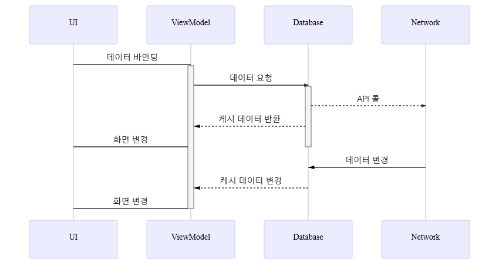
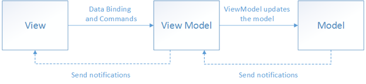
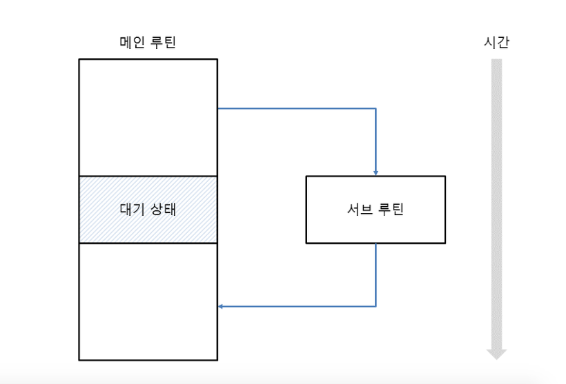
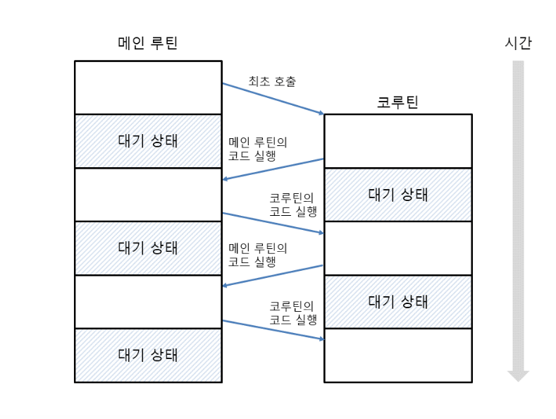

# 안드로이드 무비
이 프로젝트는 제 개인적인 토이 프로젝트입니다

## 목적
이프로젝트의 목적은
[Kotlin coroutines with Architecture components](https://developer.android.com/topic/libraries/architecture/coroutines)를
이용하여 MVVM페턴에 적용 시키는 것입니다

## 빌드 환경
두가지 타입의 빌드 환경이 있습니다

1.   **production:** 이 프로젝트 외부 서버와 통신 하는 환경입니다 이미 구축
     되어있는 서버에 접근 합니다 빠른 테스트를 원하시면 production으로
     빌드하시기 바랍니다 기본 설정입니다
2.   **local:** 로컬에서
     [movie-backend](https://github.com/Young-Gon/movie-backend) 를 다운
     받아 테스트 할수 있습니다 (테스트 하기 편하도록 몇개의 영화정보를 포함
     하고 있습니다)

## 프로젝트의 구조
프로젝트의 기본 구조는
[GithubBrowserwithArchitectureComponents](https://github.com/googlesamples/android-architecture-components/tree/master/GithubBrowserSample)를
기반으로 하고 있습니다  
이 프로젝트에 관해 간략히 설명하면,
[Android Architecture Components](https://developer.android.com/topic/libraries/architecture)와
**MVVM**페턴을 설명하기 위한 예제 프로젝트로, Github의 리포지토리를
가저와서 화면에 출력하는 셈플 예제 입니다  
이 때, 깃헙과 API 통신은
[Retrofit](http://devflow.github.io/retrofit-kr/)을 사용하며, 로컬 케시
디비로
[Room](https://developer.android.com/topic/libraries/architecture/room)
라이브러리를 사용하고 있습니다  
데이터 흐름은 화면이 표시되면, 로컬 디비에서 데이터를 읽은 다음, API
통신으로 데이터를 갱신 하게 됩니다  
이렇게 하면
[Adnroid Data Binding](https://developer.android.com/topic/libraries/data-binding?hl=ko)으로
바인딩 된 뷰가 반응하여 화면이 갱신 되는 구조입니다  
또한 DI(Dependency Injection: 의존성 주입)로
[Dagger](https://github.com/google/dagger)를 사용 하고 있는데, DI는
필요한 클레스 인스턴스를 생성해서 사용하지 않고, DI라이브러이에 요청해서
받이 오는 방식입니다  
이 방식의 장점은 인스턴스를 주입할 때 주입할 모듈을 교체 하기가 용이 하기
때문에 테스트 용 모듈을 주입하여 테스트 하기가 간편합니다. 또한, AAC
ViewModelFectory를 만들필요 없이 VM을 만들 수 있습니다



이 프로젝트 역시 기본적으로 위에 설명한 방식으로 동작 하고 있습니다  
차이점은
1. DI로 [Dagger](https://github.com/google/dagger) 대신에
   [Koin](https://insert-koin.io/)을 사용 하고 있다는 점
   > koin은 Dagger와 달리 런타임에 DI를 수행하여, dagger에 비해 적용하기
   > 쉬운 장점이 있습니다
2. Retrofit API통신에 coroutine을 사용하여 async/await 패턴으로
   구현하였으머,
   [Kotlin coroutines with Architecture components](https://developer.android.com/topic/libraries/architecture/coroutines)를
   사용하여 획득한 데이터를 VM에 적제 하고 있음
3. Repository를 생략하고 ViewModel에서 바로 구현함

이 있습니다

### MVVM 의 이해
**MVVM**은 Model-View-ViewModel의 약자로서 안드로이드 앱의 구조를 정의 하는
일련의 아키텍처 페턴을 말합니다.  
이 아키텍처 페턴은 앱을 어떻게 설계할 것인가의 질문에 관한 답변으로,
딱히 정답이 있는 것도 아니고 사람마다 각 페턴에 대한 이해도도 다릅니다  
MVVM 을 이해하기 전에 MVVM 페턴이 나오기 까지의 과정을 살펴 보면서, 기존
페턴이 해결하려고 한 문제점은 무엇이고, 그 과정중에 새로 발생한 문제점은
무엇인지 살펴보면서 MVVM은 어떤 식으로 해결하고 있는지 살펴보겠습니다

#### MVC
**MVC**는 *Model-View-Controller* 의 약자로 웹 환경에서 많이 쓰는 방식
입니다  
컨트롤러에서 입력을 받으면, Model에서 데이터를 입력 받아서, View로
보내는 방식입니다  
초기에 웹 개발진영에서 넘어오신 분들이 이방식을 안드로이드에 적용하기
위해 노력했지만, 이 방식은 정직인 정보를 대량으로 보내는 웹 환경에서는
잘 동작 하지만, 소량의 데이터를 다양한 방법으로 처리하는 이벤트 드리븐
방식의 안드로이드와 맞지 않습니다  
특히 View와 controller의 특성을 동시에 가지고 있는 Activity의 특성으로
인해 View와 controller를 나눌수 없어 페기 하게 되었습니다

#### MVP
**MVP**는 Model View Presenter 의 약자로 MVC 페턴을 안드로이드에
적용할려는 노력이 실패로 돌아가고, Activity가 가지는 View와 Controller의
기능을 분리하는데 좀더 집중하기 위해 나왔습니다  
뷰의 이벤트를 처리를 최대한 프리젠터에서 처리하고 엑티비티는 뷰에 관한
컨트롤을 끊어 엑티비티에서 뷰를 분리시키는 것을 목표로 하고 있습니다  
이 페턴의 단점은 엑티비티에서 처리가능한 로직들이 프리젠터로 옮겨 가면서
필요 없는 보일러 플레이트가 발생하고 의미없는 인터페이스와 함수 호출이
증가 하면서, 구조가 복잡해지고, 유지보수를 어렵게 한다는 것입니다

#### MVVM
**MVVM**은 1990년대 Microsoft C# 진영에서 나온 게념 입니다.  
핵심 기능은 **data binding**으로 ViewModel은 View가 관찰할 수 있는
옵저버 클래스를 두고 뷰는 이 옵저버 클래스의 데이터를 관찰 합니다
(이과정을 데이터 바인딩이라고 합니다)  
View가 ViewModel의 옵저버를 연결시키면 ViewModel은 Model에서 갖고 온
데이터를 이 옵저버에 넣어 둡니다  
이벤트가 옵저버의 데이터를 변경시키고 데이터가 변경되면 이를 관찰 하고
있던 뷰가 케치하여 뷰 스스로 화면을 갱신하게 됩니다  
이 과정에서 뷰모델은 뷰의 화면 갱신에 전혀 관여 하지 않으며, 데이터의
조작에 좀더 집중할 수 있습니다



이를 코드로 옮기면 다음과 같습니다
``` xml
<?xml version="1.0" encoding="utf-8"?>
<layout
    xmlns:android="http://schemas.android.com/apk/res/android">
    <!-- 1. 뷰모델 선언 -->
    <data>
        <variable
            name="vm"
            type="MainViewModel" />
    </data>
    <FrameLayout
        android:layout_width="match_parent"
        android:layout_height="match_parent">
        <!-- 2. 데이터 바인딩  -->
        <TextView
            android:id="@+id/et_lottie_list"
            android:layout_width="match_parent"
            android:layout_height="wrap_content" 
            android:text="@{vm.name}"
            android:onClick="@{(() -> vm.nameClick()}" />
            <!--5. 이벤트 발생 및 6. 화면 갱신-->
    </FrameLayout>
</layout>
```
```kotlin
 class MainActivity : AppCompatActivity() {
  fun onCreate() {
    // 3. 바인딩 겍체를 통해 엑티비티와 뷰 연결
    binding = DataBindingUtil.setContentView(activity, layoutResIdRes)
    // 4. 뷰에 뷰모델 할당
    binding.vm = MainViewModel()
  }
}

class MainViewModel {
  // databinding 을 통해 view 와 연결
  val name = ObservableField("")
 
  init {
    name.set(initName())
  }
  
  private fun initName() : String = "John"

  // 5. 이벤트 발생 및 데이터 갱신
  fun nameClick() = name.set("Click!!")
}
```
1. 안드로이드 XML에서 뷰모델을 선언 합니다
2. XML상에서 필요한 데이터를 뷰모델에서 가저다 씁니다.  
   여기서는 `et_lottie_list`에서 `vm.name`을 사용하고 있습니다
3. 엑티비티에서 xml을 연결시키는 `setContentView()` 함수를
   `DataBindingUtil`을 사용하여 `binding` 객체를 통해 연결 시킵니다
4. `binding* 객체에 `ViewModel`을 할당 하면 1에서 선언한 뷰모델로
   인스턴스가 들어 옵니다
5. `et_lottie_list`에서 클릭 이벤트가 발생하면 VM으로 전달되고 VM에서는
   데이터를 변경 합니다
6. 데이터가 변경되면 2에서 연결된 `et_lottie_list`의 화면이 갱신됩니다


이 페턴의 장점은 View 스스로 화면을 갱신 함으로 화면 관련 로직은 View에,
데이터 관련 로직은 ViewModel로 구분이 가능 합니다  
이때 엑티비티는 뷰 및 뷰모델을 알고 있으며, 뷰는 뷰모델을 알고 있습니다  
뷰 모델은 모델만 알고 있으며, 데이터의 조작에만 집중 할 수 있습니다

기존의 구조는 **이벤트발생->데이터변경->화면갱신**이 한사이클에서
발생한다면, MVVM 구조에서는 **이벤트발생->데이터변경**,
**데이터관찰->화면갱신** 두사이클로 나눠 지게 됩니다  
즉, 기존에는 데이터를 변경한 쪽에서 화면 갱신의 책임이 있다면, MVVM
구조에서는 화면갱신의 책임은 데이터를 관찰하는 뷰가 가지게 됩니다  
이런식으로 하면 예전에는 다른 엑티비티에서 변경한 데이터를
*onActivityResult()* 같은 리스너를 통해 화면 갱신의 책임을 주고 받고
했지만, MVVM에서는 화면 갱신의 책임이 뷰에 있으므로 그럴필요가 없어지고
코드는 더 간단해 지고 클레스의 기능이 더욱 명확해 지게 됩니다  
이 구조에서 엑티비티의 역할은 context와 관련된 다른 activity, fragment
띄우기, systemService 호출, 라이프 사이클 제어등과 같은 엑티비티 본연의
기능으로 축소 됩니다ㅊ

### Kotlin coroutines with Architecture component의 이해
[Kotlin coroutines with Architecture component](https://developer.android.com/topic/libraries/architecture/coroutines)는
coroutine을 사용하여 async/await 패턴으로 받아온 데이터를 VM에 적제 시키는
모듈입니다 이 모듈이 필요한 이유는 길지만 시작은 MVVM 페턴을 설명하는 구글
셈플 예제
[GithubBrowserwithArchitectureComponents](https://github.com/googlesamples/android-architecture-components/tree/master/GithubBrowserSample)에
서 시작합니다  
이 셈플에서는 liveData를 이용하여 MVVM 페턴으로 앱을 제작하는 방법이
나오는데 GitHub에서 repository를 긁어서 보여 주는 앱입니다 보시면
아시겠지만 꽤 복잡한 구조인데 전반적으로 VM을 만드는 방식이나 Room을 디비
케쉬로 이용하는 방법 LiveData를 이용하는 방법에 대해서 잘 만들어진 앱입니다
문제가 되는 부분은 Retrofit을 사용하여 네트워킹을 하기위해서
`LiveDataCallAdapter`라는 아답터를 사용합니다 이 아답터는 retrofit으로 API
콜을 하면 결과값을 파싱하여 LiveData형태로 만들어 주는 아답터입니다 이것이
왜 문제가 되는지 알라볼려면 VM내에서 안드로이드 데이터바인딩이 작동하는
방식에 대한 이해가 필요하니 이에 대해 간략히 언급하고 지나 가겠습니다

#### 안드로이드 데이터바인딩의 작동 방식
안드로이드 데이터 바인딩의 개념은 변수와 화면을 연결(binding)을 연결시켜
놓고, 변수의 값이 변하면 화면도 따라서 변하는 개념 입니다 즉
*username*이라는 변수를 만든 다음 화면에 *사용자: ${username}*이라고
해놓으면 username의 값이 변경될때 마다 화면의 사용자의 값이 바뀝니다.  
안드로이드 SDK는 이 방식을 구현하기 위해서 특별히 거창한 방식을 사용하는
것이 아니라 우리가 익히 알고 있는 listener 방식을 사용합니다 즉, Listener
인터페이스를 만들어 놓고 특정 데이터의 값이 변경 될때 마다 listener의
onDataChanged()함수를 호출 하는 방식 입니다  
안드로이드에서는 이 리스너를 LiveData라는 클래스로 구현 했고
Databinding내부적으로 이 liveData 클래스를 사용하고 있습니다 우리가
Databinding을 사용하기 위해서 VM내부에 할일은 연결할 데이터들을 LiveData
클래스 내부에 두고 화면에서 이 Livedata를 통해서 값을 참조하게 구현 하면
됩니다.  
하지만 이방식에는 다음과 같은 문제가 있습니다  
어떤 함수가 다음과 같이 LiveData를 반환한다고 했을때

``` kotlin
fun findById(movieId: Long): LiveData<Movie>
```

개발자는 화면이 표시 될 때 movie의 값을 받고 싶어 다음과 같이 초기화 할때
값을 가지고 오도록 만들었습니다

``` kotlin
var movie:LiveData<Movie> = movieDao.findById(movie.id)
```

만약 초기화 후 이 *movie*의 값을 바꾸고 싶다면 어떻게 해야 할까요?

``` kotlin
fun onClickSearch(keyword: String){
   movie=movieDao.findByName(keyword) 
}
```

이런식으로 사용할 수 있습니다 하지만 이런식으로 사용하면 livedata의 movie
변수가 참조하고 있던 바인딩된 livedata는 사라지고 새로운 livedata의
인스턴스를 참조 하게 됩니다 이렇게 되면 값은 바꼈지만 화면은 변하지 않습니다
예전에 바인된 livedata를 계속 참조 하고 있죠

``` kotlin
class MovieViewModel(
    keyword: String
){
    val keywordLiveData: LiveData<String> = MutableLiveData<String>(keyword)
    val movie: LiveData<Movie> = Transformations.switchMap(keywordLiveData){ keyword ->
        movieDao.findById(keyword)
    }
    
    fun onClickSearch(keyword: String){
       keywordLiveData.value=keyword
    }
}

```

이렇게 livedata를 변경 하지 않으면서 livedata내의 값을 바꾸려면 변경 시키는
값을 미리 livedata형식으로 가지고 있다가 그 값이 참조하는 livedata의 값을
바꾸면 따라서 movie가 바뀔수 있도록 해야 합니다 무슨 말인지 잘 모르겠죠?
더구나 google 셈플 에서는 room에서 LiveData를 받아오고 retrofit에서도
livedata를 받아 옵니다 두개의 livedata를 어떻게 하나의 livedata로 만들까요?
google 셈플에서는 `NetworkBoundResource`라는 클레스를 만들어 처리 하고
있습니다 내부적으로 `MediatorLiveData`를 사용하여 구현하는데, 이 클레스가
더 복잡해지는 이유는 그냥 두개의 livedata를 합치는 것이 아닌 중간에 네트워크
상테를 저장하는 `Resource`라는 클레스가 끼어 듭니다 이 `Resource`는
success, error, loading이라는 3가지 상태의 네트워크 상태를 표시하는데
`Livedata<Resource<Movie>>`와 같이 livedata와 livedata가 가리키려는 값
사이에 끼여 듭니다 결과적으로 `Livedata<Movie>`를 반환하는 데이터베이스와
네트워크를 `Livedata<Resource<Movie>>`같은 방식으로 변환해야 하는데 이게
쉽지가 않습니다 또한 결과 값이 필요가 없는 post나 delete METHOD 들은 이
`NetworkBoundResource` 클레스를 사용할 수 없습니다 이쯤되면 왜 굳이
livedata를 사용해야 하나 하는 회의감이 들기 시작합니다

이런 상황을 위해 안드로이드에서는 livedata좀더 유연하고 사용하기 쉽게 바꿔줄
필요성을 느끼게 되었습니다

#### Kotlin coroutines
코틀린 코루틴은 스레드를 관리해주는 일종의 쓰레드 라이브러리라고 보시면
됩니다. 안드로이드는 다양한 쓰레드 클래스가 있는데, 자바의 기본 Thread 부터
Handler, Executor, Looper등 다양한 쓰레드 관리 클레스가 있습니다.  
그러면 왜 이 코루틴이라는 것이 또 등장하게 되었을까요?  
코틀린 만을 위한 쓰레드 모듈이 필요하다는것도 이유 이겠지만 이 코루틴은 작동
방식이 일반 쓰레드와 다릅니다  
일반적으로 스레드의 작동방식은 스레드가 분기하고 작동이 끝나면 결과물을
어딘가에 저장한후 메인 스레드에게 알립니다 그사이에 메인스레드는 다른 일을
하구요. 혹시나 메인 스레드가 작업 스레드가 끝날때 까지 기다릴순 있지만
그렇게 하면 메인 스레드도 행이 걸리게 되어 버리니 보통은 그렇게 하지
않습니다



하지만 코루틴은 좀 다릅니다 평범한 함수를 호출하면 그 함수의 내부 로직을
다른 스레드에서 수행하고 결과만 받을 수 있습니다 그사이에 행이 걸리거나 하지
않습니다 이렇게 스레드를 넘나드는 방법이 아주 간단 합니다



예를 들어 네트워크 통신을 한다고 하면 사람들이 많이 쓰는 Retrofit을 기준으로
설명 해보겠습니다  
Retrofit API는 대충 이렇게 생겼습니다

``` kotlin
fun getMovieById(@Path("id") id: Long): Call<Movie>
```

무비를 서버에서 id를 기준으로 찾아 오는 API입니다 리턴값으로 Call이라는
클래스를 던지는데 여기에 성공했을때, 실패 했을때 처리할 로직을 넣은다음 콜을
합니다

``` kotlin
val call:Call<Movie> = api.getMovieById(12)
call.enqueue(object: Callback<Movie>{
    override fun onFailure(call: Call<Movie>, t: Throwable) {
        TODO("통신 실패시 할일")
    }

    override fun onResponse(call: Call<Movie>, response: Response<Movie>) {
        val result:Movie?=response.body()
        TODO("통신 성공시 할일")
    }

})
```

하지만 코루틴을 사용하면 이렿게 바뀝니다

``` kotlin
 fun getMovieById(@Path("id") id: Long): Movie
```
``` kotlin
try{
    val result: Movie=api.getMovieById(12)
    TODO("통신 성공시 할일")
} catch (e: java.lang.Exception) {
    TODO("통신 실패시 할일")
}
```

일반 펑션콜과 똑같습니다

물론 이렇게 하기 위해 몇가지 조건이 필요합니다
1. 호출할 평션이 *suspend*펑션일것
2. suspend 펑션을 호출 할때 coroutineScope 내부 일것

위 조건을 적용해서 코드를 다시 짜면 이렇게 됩니다

``` kotlin
suspend fun getMovieById(@Path("id") id: Long): Movie
```
``` kotlin
CoroutineScope(Dispatchers.IO).launch {
    try{
        val result: Movie=api.getMovieById(12)
        TODO("통신 성공시 할일")
    } catch (e: java.lang.Exception) {
        TODO("통신 실패시 할일")
    }
}
```

위의 Call 클레스 에 성공시 할일 실패시 할일을 코드 조각으로 넣어서 호출하는
방식을 **Promise** 방식 아래 와 같이 일반 펑션콜을 호출 하는 방식을 **async/await**
방식이라고 합니다

이 async/await 방식이 Promise 방식보다 좋은점은 코드 블럭이 줄어 들고
코드의 가독성이 좋아 진다는 점입니다 코드의 가독성이 좋아지면 이해하기 쉽고
오용할 여지가 줄어 듭니다 쉽게 말해 유지보수가 좋아지고 버그가 적어집니다

#### Android VM내에서 디비 쿼리와 네트워크 API호출을 다루기
이제 DB애서 쿼리 해혼 값과 네트워크에서 API로 호출한 값을 동시에 다룰려면
어떻게 해야 할까요? 참고로 디비의 함수 모양은 이렇게 생겼습니다

``` kotlin
fun findById(movieId: Long): LiveData<Movie>
```

네트워크는 이렇게 생겼습니다

``` kotlin
suspend fun getMovieById(@Path("id") id: Long): Movie
```

두개의 리턴값이 다르죠? 하지만 이것을 한 변수에 담고 싶습니다 디비 쿼리해온
값을 케쉬로 화면을 구성하고 네트워크로 들어온 값으로 최신 정보로 변경 하는
것이죠 어떻게 해야 할까요? 이럴때 사용하기 위해서 구글에서 Kotlin
coroutines with Architecture component을 제작 했습니다  
사용법은 간단합니다  
livedata라는 람다식이 있습니다 이것 자체가 CoroutineScope을 상속 받기
때문에 이 람다식 안에서는 suspend 펑션을 호출 할수 있습니다 그리고 이
안에서는 emmit(), dispose()함수를 통해 수시로 livedata안의 값을 바꿀수
있습니다  
예를 들어 보겠습니다 아까 우리가 사용한 movie: LiveData<Movie>에 값을 집어
넣는다고 했을때
``` kotlin
val movie = liveData {
    // 디비로 부터 값 설정
    val disposable= emitSource(movieDao.findById(movie.id))
    try {
        // 네트워크 콜
        val detail=api.getMovieListById(movie.id)
        // 디비의 값을 변경해도 livedata의 값이 자동으로 변경되지 않도록 
        // livedata와 db 쿼리의 연결 해제 
        disposable.dispose()
        // 디비 값 변경
        movieDao.insert(detail)
        // 다시 디비의 값 설정
        emitSource(movieDao.findById(movie.id))
    } catch (e: java.lang.Exception) {
        Timber.e(e)
        emitSource(movieDao.findById(movie.id))
    }
}
```
보시는 봐와 같이 아주 깔끔한 코드를 만들수 있습니다. 비동기콜이 자연스러운
동기 콜처럼 보이기 때문에 필요한곳에 원하는 코드를 넣으면 되고요  
값이 바뀌는 시점에 바뀐 값을 넣어 주면 됩니다  
그렇다면 이코드를 google 셈플처럼 livedata와 movie 사이에 Resource를 넣어
네트워크 상테를 넣고 싶으면 어떻게 해야 할까요?  
이것도 아주 쉽습니다
``` kotlin
val movie = liveData {
    val disposable= emitSource(movieDao.findById(movie.id).map{
        // 네트워크 상태를 표시하는 Resource 클레스르 사용하여 최종 결과물 변경
        Resource.loading(it)
    })
    try {
        val detail=api.getMovieListById(movie.id) 
        disposable.dispose()
        movieDao.insert(detail)
        emitSource(movieDao.findById(movie.id).map{
            // 네트워크 상태를 success로 변경
            Resource.success(it)
        })
    } catch (e: java.lang.Exception) {
        Timber.e(e)
        emitSource(movieDao.findById(movie.id).map{
            // 네트워크 상태를 error로 변경
            Resource.error(it)
        })
    }
} 
```

이 coroutines with Architecture component가 없었을 때는 맞지 않는
리턴값들을 원하는 형태로 바꾸기 위해서 수많은 Transformation.map()과
switchMap()과 MediatorLiveData와 MutableLiveData()와 그들이 만들어 내는
코드 블럭들이 필요 했습니다 수시로 발생하는 버그들은 덤이구요  
이 라이브러리를 사용하고 나서 부터는 아주 깔끔한 코드들을 얻을수 있게
되었습니다 물론 유연한 구조 떄문에 어디서든지 사용할 수 있고요 수시로 나오는
버그들이 줄었습니다

안드로이드는 수년간 정말 많은 것을 바꿔 왔습니다 옜날에 AsyncTask를 사용하던
시잘과 비교하면 완전 다른 것이 되어 버렸죠 IDE부터 언어 앱 구조 까지요
하지만 제가 느끼기에 안드로이드는 이제서야 완벽에 가까워 진것 같습니다
지금까지는 개발하면서 나사하나가 빠진것 같은 느낌이 들때가 많았기 때문이죠
아무쪼록 이글을 보시는 분들도 분명 MVVM페턴을 학습 하시다가 어딘가 부족한
부분이 생겨서 찾고 찾다가 여기까지 오시지 않으셨나 생각이 듭니다 그런분들꼐
이 소스가 조금이나마 도움이 되었으면 좋겠습니다


### 사용 라이브러리
1. Kotlin - 자바를 대체하는 차세대 프로그래밍 언어입니다 람다식과 함수형
   프로그래밍에 관해 사전 지식이 있으면 좋습니다
2. androidx: android-support library를 대체하는 차세대 서포트
   라이브러리입니다
3. KTX: 코틀린을 지원하기 위한 안드로이드 SDK 입니다
4. AAC: MVVM 페턴을 지원하기 위한 라이브러리입니다
5. Room: SQLite를 JPA 계념에 맞게 리페키징한 데이터베이스 라이브러리
   입니다 JPA의 개념에 대해 알고 계시면 좋습니다
6. Retrofit: HTTP RESTFul 통신을 하기 위한 통신 라이브러리입니다.
   RESTFul 계념과 JSON 구조에 대해 알고 계시면 좋습니다
7. GSon: JSON 파싱 라이브러리입니다
8. Coroutines: kotlin을 만든 jetbrain사에서 async/await 페턴을 지원하기
   위해 만든 쓰레드 라이브러리입니다 async/await 페턴에 대해 알고 계시면
   좋습니다
9. Koin: DI(Dependency Injection)을 지원하기 위한 DI 라이브러리입니다 DI
   개념에 대해서 알고 계시면 좋습니다
10. glide: 이미지 케싱 및 로딩 라이브러리입니다
14. Timber: 로깅 라이브러리입니다.